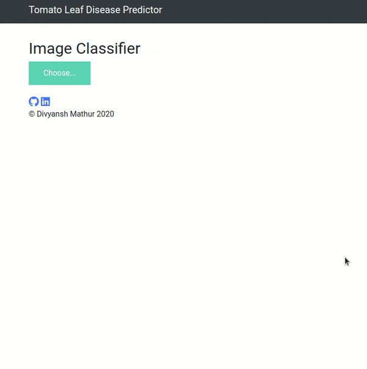

# Tomato-Leaf-Disease-Detection-

  

This repository consists of files required for end to end implementation and deployment of Deep Learning Tomato Leaf Disease Prediction web application deployed with flask.

## Table of Contents
  * [About the App](#about-the-app)
  * [Technologies Used](#technologies-used)
  * [Bug / Feature Request](#bug---feature-request)


## About the App

A glimpse of the web app:



The Tomato Leaf Disease Predictor is a flask web application which classifies a plant/leaf image into 10 categories viz. 'Tomato_mosaic_virus', 'Early_blight', 'Septoria_leaf_spot', 'Bacterial_spot', 'Target_Spot', 'Spider_mites Two spotted_spider_mite', 'Tomato_Yellow_Leaf_Curl_Virus', 'Late_blight', 'Healthy', and 'Leaf_Mold'. The code is written in Python 3.6.10 and makes use of Keras and Tensorflow libraries in developing an InceptionV3 based image classification web application. 

If you don't have Python installed, you can find it [here](https://www.python.org/downloads/). If you are using a lower version of Python you can upgrade using the pip package, ensuring you have the latest version of pip. To install the required packages and libraries, run this command in the project directory after [cloning](https://www.howtogeek.com/451360/how-to-clone-a-github-repository/) the repository:
```bash
pip install -r requirements.txt
```


## Technologies Used


 [](https://gunicorn.org) [](https://scikit-learn.org/stable/) 

## Bug / Feature Request

If you find a bug (the website couldn't handle the query and / or gave undesired results), kindly open an [issue](https://github.com/divyansh1195/Tomato-Leaf-Disease-Detection-/issues) here by including your search query and the expected result


## Please do ⭐ the repository, if it helped you in anyway.
